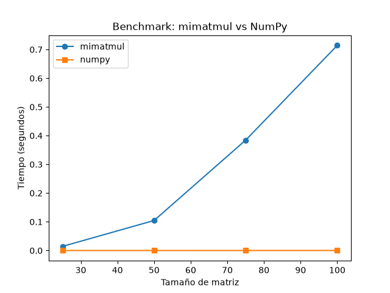

# P0-godoy-natalia

Proyecto 0 de la materia. El proyecto configura un ambiente reproducible en Python,
obtiene información real del computador e implementa y compara una multiplicación de
matrices sencilla (`mimatmul`) contra NumPy.

## Instalación y configuración

Clonar el repositorio:

```powershell
git clone https://github.com/nataliapazgj/P0-godoy-natalia.git
```

Entrar a la carpeta:

```powershell
cd P0-godoy-natalia
```

Crear el ambiente virtual:

```powershell
python -m venv .venv
```

Activar el ambiente virtual en Windows PowerShell:

```powershell
.\.venv\Scripts\Activate.ps1
```

Instalar las dependencias desde `requirements.txt`:

```powershell
pip install -r requirements.txt
```

> Si PowerShell bloquea `Activate.ps1` por la política de ejecución, los comandos
> pueden ejecutarse directamente con `.\.venv\Scripts\python.exe`.

## Ejecución

Generar la información del computador en `data/system_info.json`:

```powershell
.\.venv\Scripts\python.exe src\system_info.py
```

Ejecutar las pruebas:

```powershell
.\.venv\Scripts\python.exe -m pytest
```

Ejecutar el benchmark (genera `data/benchmark_results.csv` y `figures/benchmark.png`):

```powershell
.\.venv\Scripts\python.exe src\benchmark.py
```

## Características del computador

Datos reales guardados en `data/system_info.json`:

| Característica | Valor |
|---|---|
| Sistema operativo | Windows 10 |
| Arquitectura | AMD64 |
| Python | 3.11.2 |
| NumPy | 2.4.6 |
| Procesador | Intel64 Family 6 Model 142 Stepping 12, GenuineIntel |
| Núcleos físicos | 2 |
| Procesadores lógicos | 4 |
| RAM total | Aproximadamente 11.83 GiB |
| RAM disponible (observada) | Aproximadamente 5.50 GiB |
| GPU | Intel(R) UHD Graphics |
| Disco total | Aproximadamente 475.8 GiB |
| Disco disponible | Aproximadamente 214.6 GiB |

## Resultados del benchmark

Se usaron tamaños de matriz 25, 50, 75 y 100, con 3 repeticiones por tamaño y
método. Los datos reales están en `data/benchmark_results.csv` y el gráfico está
en `figures/benchmark.png`:



`mimatmul` aumenta considerablemente su tiempo al aumentar el tamaño de la matriz,
mientras que NumPy es mucho más rápido.

## Observaciones de rendimiento

Los valores siguientes provienen de ejecuciones extendidas de ambos métodos,
realizadas específicamente para observar CPU, memoria y GPU en el Administrador de
tareas. Son mediciones separadas del benchmark definitivo de tamaños 25, 50, 75
y 100, cuyos resultados están en `data/benchmark_results.csv`:

- `mimatmul`, n=250, 4 repeticiones: 38.267 s
- CPU observada de `mimatmul`: aproximadamente 22 %
- Memoria del proceso: aproximadamente 17 MB
- NumPy, n=2000, 100 repeticiones: 33.766 s
- CPU observada de NumPy: aproximadamente 61 %
- Memoria del proceso: aproximadamente 145 MB
- Se observó aproximadamente 80 % de actividad global de GPU, aunque no se puede
  afirmar que NumPy utilizó esa GPU: la observación global no permite atribuir esa
  actividad al proceso.

Algunas observaciones:

- `mimatmul` parece trabajar principalmente con un núcleo/hilo lógico.
- NumPy mostró mayor utilización de CPU y parece aprovechar varios recursos de
  procesamiento.
- NumPy es más rápido por sus implementaciones numéricas optimizadas.
- Las repeticiones cambian ligeramente por la carga del sistema, la planificación
  del procesador y otros procesos.
- Con aproximadamente 5.50 GiB de RAM disponible, una sola matriz `float64`
  cuadrada tendría un máximo teórico cercano a 27000 x 27000. Como para multiplicar
  A y B y almacenar el resultado se requieren varias matrices, una estimación
  teórica más realista es cercana a 15700 x 15700. No sería recomendable utilizar
  toda la RAM disponible.

## Uso de OpenCode

Durante el proyecto usé OpenCode para escribir y revisar el código:

- OpenCode me ayudó a completar las pruebas de `mimatmul` y a crear la estructura
  del benchmark.
- Con el benchmark hubo un detalle: la primera versión de `benchmark.py` tenía la
  sintaxis correcta pero no funcionaba al ejecutarla desde la raíz. Había que
  corregir el import de `mimatmul`, y eso quedó solucionado.
- De los archivos del proyecto, `benchmark.py` es el que mejor comprendo, porque lo
  revisé varias veces: cómo genera las matrices, cómo hace las repeticiones y cómo
  compara `mimatmul` con NumPy.
- Aunque es el que mejor entiendo, todavía hay partes de su funcionamiento que no
  tengo claras, sobre todo algunos detalles de cómo se miden los tiempos y cómo se
  generan los resultados.
